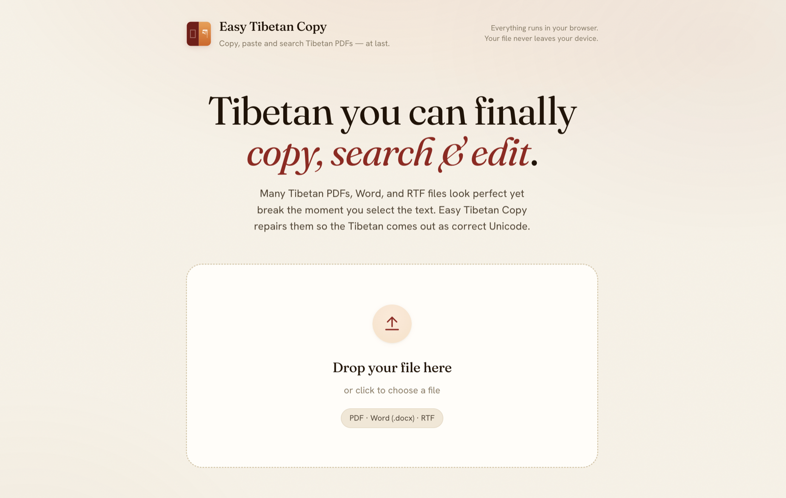

<div align="center">


# Easy Tibetan Copy

**Copy, paste and search Tibetan PDFs — at last.**

Drop a **PDF**, **Word** or **RTF** file and get correct Unicode back.
Everything runs in your browser. Your file never leaves your device.

<br>

[](https://buda-base.github.io/easy-tibetan-copy/)
&nbsp;
[](LICENSE)
&nbsp;


<br>

<a href="https://buda-base.github.io/easy-tibetan-copy/">
  
</a>

</div>

---

## Why

Many Tibetan PDFs, Word and RTF files look perfect on screen but fall apart the
moment you select the text: copy-paste returns gibberish, search finds nothing,
and the characters come out in some pre-Unicode legacy encoding. **Easy Tibetan
Copy repairs them** so the Tibetan comes out as correct, searchable Unicode —
right in the browser, with **no server and nothing uploaded.**

## What it does

| | |
|---|---|
| 🩹 **Fix the PDF** | Repairs the embedded font's `/ToUnicode` map so copy-paste, search and extraction return correct Unicode, then hands back a fixed PDF to download. Pre-Unicode **legacy Tibetan fonts** (TibetanChogyal, Ededris/Dedris, …) are handled automatically — no toggle, no extra step. |
| 📄 **Extract text** | Pulls clean Unicode out of the PDF, optionally taking **only odd or only even pages** (handy for pecha-style books printed two-up). The preview and the exported **Word `.docx`** keep the original **font sizes, bold/italic and paragraph flow**; a plain **`.txt`** is also available. |
| 🔁 **Convert Word / RTF** | Drop a `.docx` or `.rtf` whose Tibetan is in a legacy font and get the **same file** back with only the Tibetan runs swapped to Unicode — all other formatting preserved. Old binary `.doc` is detected and you're asked to re-save as `.docx` first. |

## Privacy

It is **100% client-side.** Your document is processed entirely in your browser
and is **never uploaded** — nothing leaves your device. The only things fetched
over the network are the runtime assets (the [Pyodide](https://pyodide.org/)
engine, the `pdf-cmap-fix` wheel and `jszip`), all cached after the first visit.
The whole app is static and hostable on GitHub Pages.

## How it works

There are two independent pipelines, picked automatically by file type:

```
web/index.html        UI (+ an import map for jszip)
web/app.js            state machine — routes by file type (pdf / docx / rtf / doc)
web/worker.js         Web Worker: Pyodide + pdf-cmap-fix + python-docx  (PDF path)
web/sw.js             service worker — caches Pyodide + the wheel for fast repeat loads
web/wheels/           the pdf-cmap-fix wheel (built by scripts/build-wheel.sh; gitignored)
web/vendor/tibetan-ansi-to-unicode/   vendored JS converter             (Word/RTF path)
```

**PDF path** — the UI hands the bytes to a **Web Worker** running Pyodide 0.29.4
(which bundles PyMuPDF 1.26.3 + fonttools). The worker installs the pure-Python
[`pdf-cmap-fix`](https://github.com/OpenPecha/pdf-cmap-fix) wheel and
`python-docx`, repairs/extracts in memory, and returns the result for download.

**Word / RTF path** — no Pyodide. The app lazy-imports the vendored
[`tibetan-ansi-to-unicode`](https://github.com/jerefrer/tibetan-ansi-to-unicode)
module, converts the document **in place**, and offers the converted file for
download.

## Run it locally

```bash
./scripts/build-wheel.sh          # builds web/wheels/pdf_cmap_fix-…whl (needs python3 + pip + git)
cd web && python3 -m http.server  # then open http://localhost:8000
```

Any static file server works — there is no build step and no backend.

## Deployment (GitHub Pages)

Pushing to `main` triggers
[`.github/workflows/deploy-pages.yml`](.github/workflows/deploy-pages.yml), which
builds the wheel and deploys `web/` to GitHub Pages. **One-time setup:** in the
repo settings, enable **Pages** with the **“GitHub Actions”** source.

## Notes & limits

- **Large files** run in the tab's memory. Files over ~20 MB trigger a warning
  (the tab can run out of memory) but can still be processed — a desktop is
  recommended for big PDFs. Typical few-MB Tibetan PDFs are comfortable, even on
  mobile.
- **No Markdown export** in the browser build: `pymupdf4llm` needs a newer PyMuPDF
  than Pyodide bundles. Extraction instead repairs the PDF, reads PyMuPDF's
  structured text, and preserves formatting into the `.docx` (plus a plain `.txt`).
- **Legacy-font coverage** depends on the font being known to `pdf-cmap-fix`.
  Report fonts that don't convert upstream at
  [OpenPecha/pdf-cmap-fix](https://github.com/OpenPecha/pdf-cmap-fix).

## Credits & license

Wraps [OpenPecha/pdf-cmap-fix](https://github.com/OpenPecha/pdf-cmap-fix) (MIT)
for PDFs and vendors
[`tibetan-ansi-to-unicode`](https://github.com/jerefrer/tibetan-ansi-to-unicode)
for the Word/RTF conversion. The preview and exported `.docx` use the
**Jomolhari** Tibetan font (SIL Open Font License), bundled at
[`web/fonts/`](web/fonts/). See [`DECISIONS.md`](DECISIONS.md) for the reasoning
behind the design. This project is released under the [MIT License](LICENSE).

<div align="center"><br><sub>Built for the Tibetan text community · <a href="https://buda-base.github.io/easy-tibetan-copy/">buda-base.github.io/easy-tibetan-copy</a></sub></div>
